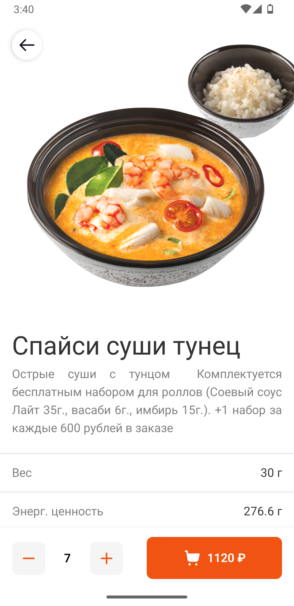
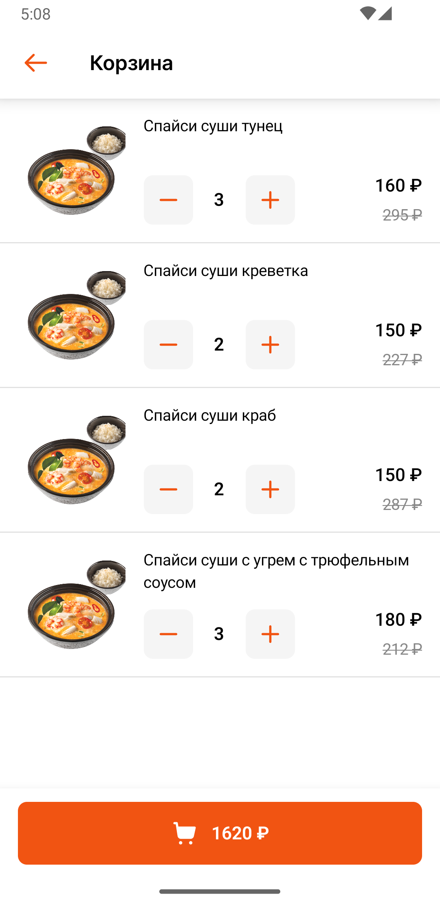

# FoodiesMobileApp
Android mobile application build fully in Kotlin with Jetpack Compose

## App Lifecycle

  
Catalog Screen

  
  ### Catalog Screen
  *Loads all Tags, Categories, Dishes from a server using Retrofit*  
    
  Options:
  - Filter dishes by tags
  - Filter dishes by categories
  - Add/remove a dish to/from cart

  Navigation:
  - To Search Screen (on Search Icon click)
  - To Dish Screen (on Dish Card click)
  - To Cart Screen (on Bottom Bar Button click)
  

  

  
Search Screen

  
  ### Search Screen
  *Loads previous prompt from Preferences DataStore*  
    
  Options:
  - Find dish matching the prompt
  - Add/remove a dish to/from cart

  Navigation:
  - To Catalog Screen
  - To Dish Screen
  - To Cart Screen
  

  

  
Dish Screen

  
  ### Search Screen
  *Shows detailed dish info*  
    
  Options:
  - Add/remove a dish to/from cart

  Navigation:
  - To the previous Screen
  - To Cart Screen
  

  

  
Cart Screen

  
  ### Cart Screen
  *Shows all dishes added to the cart*  
    
  Options:
  - Add/remove a dish to/from cart
  - Confirm the order

  Navigation:
  - To the previous Screen
  - To Catalog Screen (after order confirmation)
  

  

